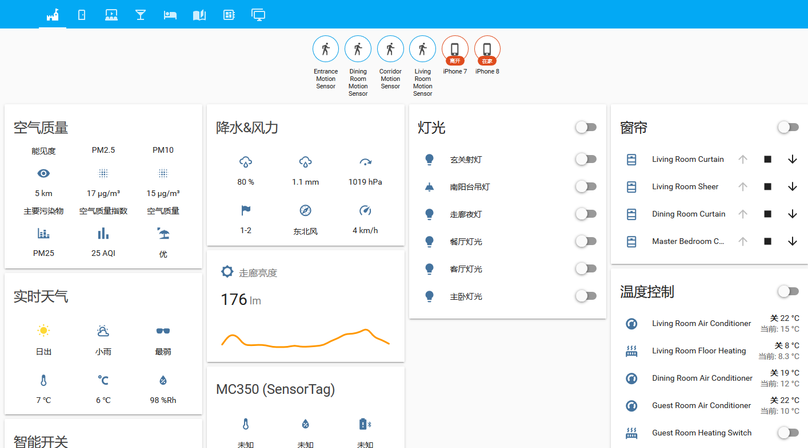

Configurations of Home Assistant - Smart Home
=======

# Feature list
- Customized KNX `climate` component. 
    * Use `target_temperature_address` as setpoint of TARGET_TEMPERATURE
    * Add specific `operation_mode` and `fan_mode` for YORK/DARKIN AC controlled by KTS router
    * Add `on`/`off` control
- Customized KNX `cover` component.
    * Dirty hack to enable cover position feedback on DPT1.009 data. See [pull request #107 of XKNX/xknx](https://github.com/XKNX/xknx/pull/107) for more information.
- Customized TI SensorTag `sensor` component.
    * Support `temperature`, `illuminance`, `humidity`, `pressure` and `battery`
    * `MC350` variant is also supported
- Customized `HeWeather` component is used to display Weather and Air quality information
- Customized `mi_water_purifier` component is used to show runing condition of Xiaomi Water purifier
    * Fixed data corruption related to I/O under multiple thread environment
- `xiaomi_aqara` component is enabled to use sensors attached to XiaoMi Gateway (Zigbee)
- `miio` component is enabled to control devices compatible with Mijia platform
- `yeelight` component is used to control lights from YeeLight
- `opple` component is used to control lights from OPPLE

## Screenshots
